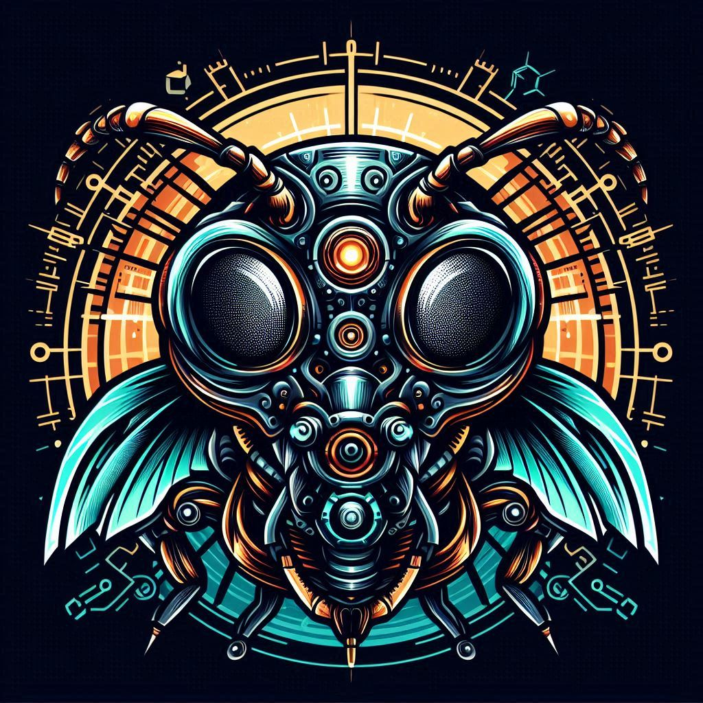

# Cromulant



[Click here for screenshots](screenshots.md)

## What is this?

This is a kind of toy you can use for your amusement.

It requires minimal interaction, most things happen automatically.

You might want to keep it running in some tiled layout.

## Usage

You start with a set of `25` to `250` random ants (`100` by default).

You can specify this anytime through `Restart`. When you restart everything resets to zero like triumphs and hits.

There are `1000` names available. This is used as the pool of names to select randomly.

Every x minutes or seconds a new update from a random ant appears.

The content of the update depends on a random number.

It can be a triumph, a hit, travel, thought, sentence.

The ant with the highest score is shown in the footer.

Ants get merged and replaced over time.

All of this happens automatically, though you can manually force actions
by using the mouse on the portraits or main menu. Try click and middle click.

Read [Algorithm](#algorithm) for more information about the mechanics.

## Installation

First make sure you have `qt` installed in your system.

In arch you can do this with: `sudo pacman -S qt6-base`

In ubuntu/debian you can do this with: `sudo apt install qt6-base-dev`

### Quick Installation

If you have `pipx` and `linux` installed you can use the following command:

```sh
pipx install git+https://github.com/madprops/cromulant --force
```

### Advanced Installation

1) Clone this repo.

2) python -m venv venv

3) venv/bin/pip install -r requirements.txt

4) Use `run.sh` or `venv/bin/python -m cromulant.main`

5) (Optional) Manually create desktop entries and icons for the application.

## Algorithm <a name="algorithm"></a>

A random ant is picked based on weights (oldest update date weighs more).
More weight means something is more likely to get picked.
Then a random number between 0 and length-of-methods-1 is picked.
For each number an action happens to produce an update.

Words (sentences) have more weight compared to the rest of the update methods.
Some methods roll another number to pick the outcome like in the case of `think`
where there are 3 `think` types, these can also have custom weights.

The top score is calculated on every new update.
The score is calculated as (Triumph - Hits).
If multiple ants have the same score, the oldest one wins.
The ant with the top score is shown in the footer.
The top ant uses a special portrait on updates.

For merge, the words of each name are used.
They get filled with random words if less than 2 words.
One word from each set is picked randomly.
The triumph and hits from each ant get combined for the new ant.
The original ants get terminated and the merged one hatches.
An extra random ant is hatched to fill the gap.

## Storage

The state of ants is stored in `~/.local/share/cromulant/ants.json`

The settings file is stored in `~/.config/cromulant/settings.json`

Or the equivalents in non-linux systems.

There is a command line argument to define a custom location for the ants state file.
This means you can have multiple states to save/load.

There is a command line argument to define a custom location for the names list.
This means you can use this with another set of names.
If not enough names are provided the remaining ants are created with random words.

## The Name

I read the word [cromulent](https://www.merriam-webster.com/wordplay/what-does-cromulent-mean) being used somewhere which turned out to be invented by The Simpsons.


I created a new programming project to practice/study and tried to use that word for the name but made a typo.

I liked the typo and made a game around it.

---

[Command line arguments](arguments.md)

[Click here for more](more.md)