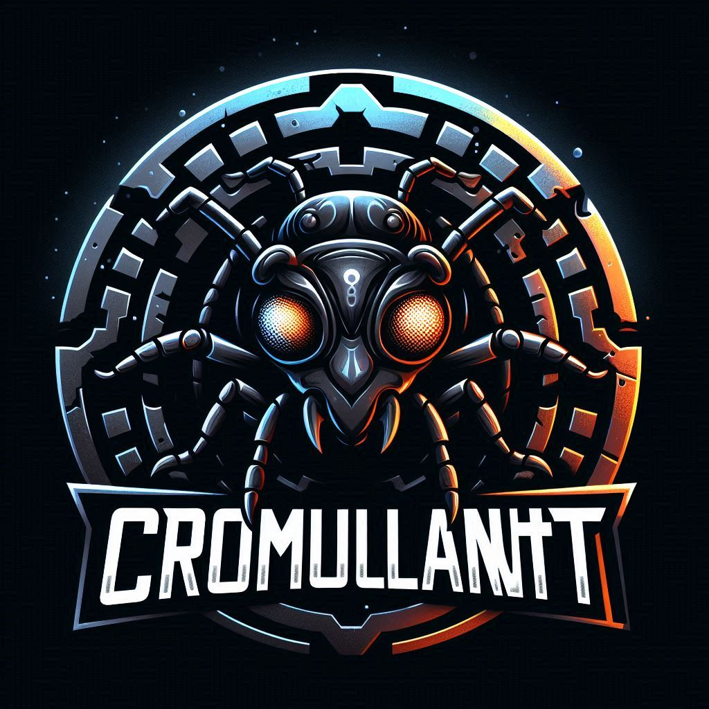

# Cromulant


## What is this?

This is a kind of toy you can use for your amusement.

You start with random ants from a list of 1000 names.

The ants will produce random updates.

The updates can be random non-sensical sentences.

The ants can score triumphs or take hits.

You can adjust the speed of the updates.

## Game Loop

You start a new game with 25 to 250 ants.

You get to read funny updates from the ants.

You watch who gets the most triumphs or the most hits.

The ant with the highest score is shown in the footer.

Ants get merged and replaced over time.

All of this happens automatically.

You can manually trigger terminations or merges by
clicking or middle clicking the images on the left.

## Usage

Just open it and place it somewhere in your monitor.

## Installation

```sh
pipx install git+https://github.com/madprops/cromulant --force
```

## Algorithm

A random ant is picked based on weights (oldest update date weighs more).
Then a random number between 0 and 12 is picked.
For each number an action happens to produce an update.

The top score is calculated as (Triumph - Hits).
If multiple ants have the same score, the oldest one wins.

For merge, the words of each name are used.
They get filled with random words if less than 2 words.
One word from each set is picked randomly.
The triumph and hits get combined.
The original ants get terminated and the merged one hatches.
An extra random ant is hatched to fill the gap.

## Technology

This is made with python + qt (pyside6)

## The name

I read the word `cromulent` being used somewhere which turned out to be invented by The Simpsons.

[It's in the dictionary now](https://www.merriam-webster.com/wordplay/what-does-cromulent-mean)

I created a new programming project to practice/study and tried to use that word for the name but made a typo.

I liked the typo and made a game about ants.

## Propaganda




## Assets


## Soundtrack

[March of The Cyber Ants](cromulant/audio/March%20of%20the%20Cyber%20Ants.mp3)