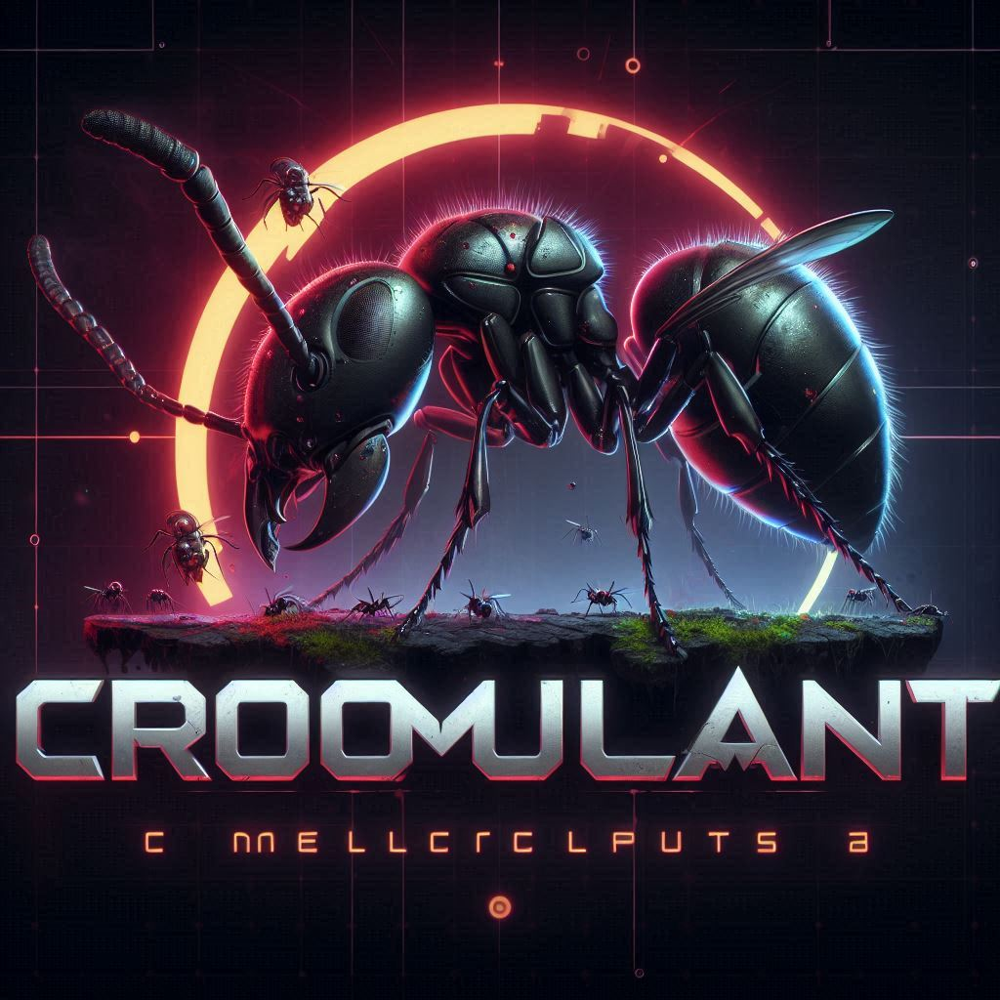

# Cromulant

## What is this?

This is a kind of toy you can use for your amusement.

You hatch ants and they are born from a list of 1000 random names.

You can also terminate them (randomly, you don't decide who is removed).

Then periodically the ants will produce random updates.

The updates can be random non-sensical sentences.

The ants can score triumphs or take hits.

You can adjust the speed of the updates.

## Game Loop

You hatch and terminate ants.

You read some funny updates.

You watch who gets the most triumphs or the most hits.

The ant with the highest score is shown in the footer.

## Usage

Just open it, hatch some ants, and place it somewhere in your monitor.

## Algorithm

A random ant is picked based on weights (oldest update date weighs more).

Then a random number between 1 and 10 is picked.

For each number an action happens to produce an update.

## Technology

This is made with python + qt (pyside6)

## The name

I read the word `cromulent` being used somewhere which turned out to be invented by The Simpsons.

[It's in the dictionary now](https://www.merriam-webster.com/wordplay/what-does-cromulent-mean)

I created a new programming project to practice/study and tried to use that word for the name but made a typo.

I liked the typo and made a game about ants.

## Propaganda

## Assets

## Soundtrack

[March of The Cyber Ants](cromulant/audio/March%20of%20the%20Cyber%20Ants.mp3)